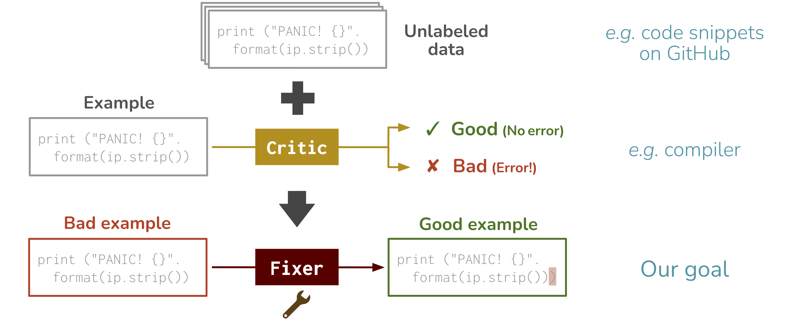
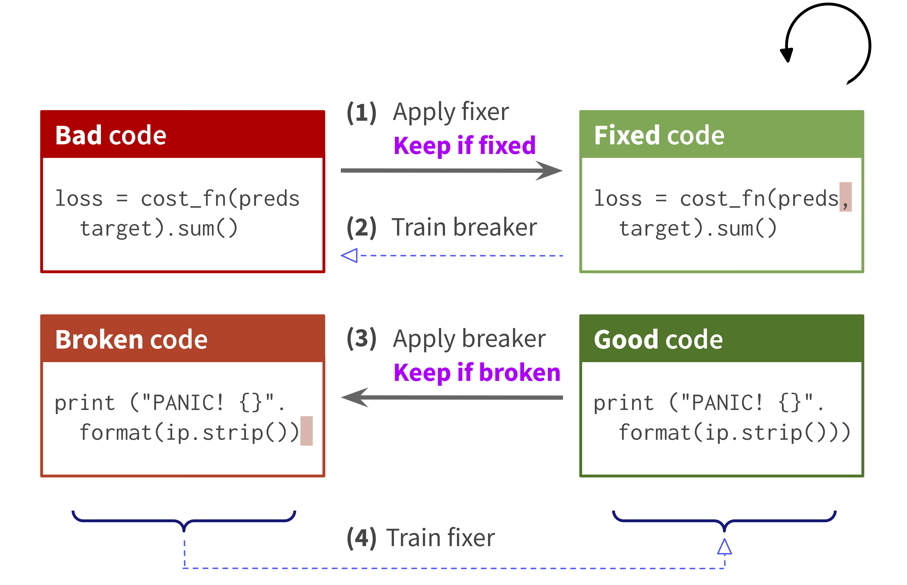

# DUMMY CHANGE IN THE READM TO BE ABLE TO OPEN A PR BECAUSE GITHUB ISSUES ARE TURNED OFF IN THE REPO SETTINGS...

# Break-It-Fix-It: Learning to Repair Programs from Unlabeled Data

This repo provides the source code & data of our paper: [Break-It-Fix-It: Unsupervised Learning for Program Repair](http://arxiv.org/abs/2106.06600) (ICML 2021).
```bib
@InProceedings{yasunaga2021break,
  author =  {Michihiro Yasunaga and Percy Liang},
  title =   {Break-It-Fix-It: Unsupervised Learning for Program Repair},
  year =    {2021},  
  booktitle = {International Conference on Machine Learning (ICML)},  
}
```
**Problem: Repair Task**
<p align="center">
  
</p>

**Our approach: BIFI**
<p align="center">
  
</p>


## 0. Dependencies

Run the following commands to create a conda environment (assuming CUDA10.1):
```bash
conda create -n BIFI python=3.7.7
conda activate BIFI
pip install tqdm
pip install torch==1.4.0 torchvision==0.5.0
cd utils/fairseq
pip install -e .
pip install numpy==1.20.1 editdistance
```
Alternatively, you can use the Dockerfile in the `docker` folder of this repo to set up the environment.


## 1. Download Data

Download all the data from [here (`data.zip`)](https://nlp.stanford.edu/projects/myasu/BIFI/data.zip) and unzip it (note: 67GB when compressed, 400GB when decompressed). This includes the GitHub-Python dataset, and all the processed training data and trained models associated with BIFI.
If you only want the original GitHub-Python dataset, you can download it from [here (`data_minimal.zip`; 1GB)](https://nlp.stanford.edu/projects/myasu/BIFI/data_minimal.zip).
After unzipping the `data.zip`, the resulting file structure will look like:
```plain
.
├── README.md
└── data/
    ├── orig_bad_code/       (GitHub-Python dataset's bad code)
    ├── orig_good_code/      (GitHub-Python dataset's good code)
    └── round0/
        ├── data_paired      (paired data used to train fixer in round0)
        └── model-fixer      (fixer trained in round0)
    ├── round1-BIFI-part1/
        ├── data_paired      (paired data used to train breaker in BIFI round1)
        └── model-breaker    (breaker trained in BIFI round1)
    ├── round1-BIFI-part2/
        ├── data_paired      (paired data used to train fixer in BIFI round1)
        └── model-fixer      (fixer trained in BIFI round1)
    ├── ...
```

### About the GitHub-Python dataset
We collected 3 million Python3 snippets from GitHub. Using the critic (Python AST parser), the code snippets are split into a set of bad code (with AST parse errors) and a set of good code (with no errors).
The set of bad code is located at `data/orig_bad_code/orig.bad.json` and good code at `data/orig_good_code/orig.good.json`.
Each entry of `orig.bad.json` or `orig.good.json` is a dictionary consisting of
  - **"code_string"**: raw code in the string format
  - **"code_toks_joined"**: the raw code is split into tokens by Python tokenizer, anonymized (string/number is replaced with special tokens `<STRING>`/`<NUMBER>`), and then joined by whitespace. The tokenization was done by `utils/code_utils.py: tokenize_python_code()`
  - **"anonymize_dict"**: mapping betweens raw string/number and `<STRING>`/`<NUMBER>` so that "code_string" can be recovered from "code_toks_joined". This recovery can be done by `utils/code_utils.py: code_toks_to_code_string()`
  - **"err_obj"**: type of the error caught by the critic (e.g. unbalanced parentheses, indentation error). This is only applicable to `orig.bad.json`.


The bad code snippets in `orig.bad.json` are split into 5 chunks (`orig.0.bad` to `orig.4.bad` in `data/orig_bad_code/`), where 3,4 is heldout as the test set and 0,1,2 is made available for BIFI training. This splitting was done by `scripts/split_orig_bad_and_good.py`


## 2. Training and Evaluation
First, train the initial fixer by running commands in `src/run-round0.py` one by one. We then consider three training algorithms on top of it: **BIFI** (our proposed method), **FixerOnly** (BIFI without breaker), and **BackTranslation** (BT; our baseline). For each algorithm,
  - **BIFI**: run commands in `src/run-BIFI.py` one by one
  - **FixerOnly**: run commands in `src/run-FixerOnly.py` one by one
  - **BT**: run commands in `src/run-BT.py` one by one

Below is an illustration for the case of BIFI.

**run-round0.sh**
```bash
export PYTHONPATH=.

#Train initial fixer on synthetic paired data
python src/c001__train_fixer.py --round_name round0 --gpu_id 0 --max_epoch 2

#Run the trained fixer on the bad code (chunk 0-4) and check the outputs by critic
python src/c003__run_fixer.py   --round_name round0 --gpu_ids '0,1,2,3,4'

#Evaluate the fixer outputs on the test set (chunk 3,4)
python src/c005__eval_fixer.py  --round_name round0
```


**run-BIFI.sh** (round 1)
```bash
#Use the fixer outputs on the bad code (chunk 0,1,2) to get new paired data (Equation 6 in the paper)
python src/c006__generate_paired_data_from_fixer.py --round_name round0 --out_round_name round1-BIFI-part1

#Train breaker on the new paired data (Equation 7 in the paper)
python src/c002__train_breaker.py --round_name round1-BIFI-part1 --gpu_id 0 --max_epoch 3

#Run the trained breaker on the good code and get new paired data (Equation 8 in the paper)
python src/c004__run_breaker.py   --round_name round1-BIFI-part1 --gpu_ids '0,1,2,3,4'
python src/c007__generate_paired_data_from_breaker.py --round_name round1-BIFI-part1 --out_round_name round1-BIFI-part2

#Train fixer on the new paired data (Equation 9 in the paper)
python src/c001__train_fixer.py --round_name round1-BIFI-part2 --gpu_id 0 --max_epoch 2 --continue_from 'data/round0/model-fixer/checkpoint.pt'

#Run the trained fixer on the bad code (chunk 0-4) and check the outputs by critic
python src/c003__run_fixer.py   --round_name round1-BIFI-part2 --gpu_ids '0,1,2,3,4'

#Evaluate the fixer outputs on the test set (chunk 3,4)
python src/c005__eval_fixer.py  --round_name round1-BIFI-part2
```
This is repeated similarly for round 2.
